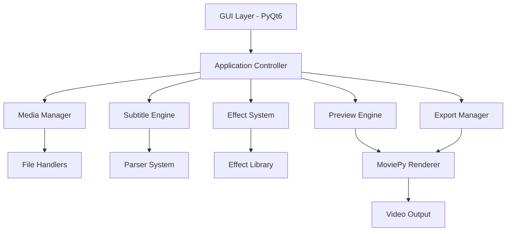

# Design Document

## Overview

The Subtitle Creator with Effects is a desktop application built using Python 3.8+, PyQt6 for the GUI framework, and MoviePy for video processing. The application follows a WYSIWYG (What You See Is What You Get) philosophy where the preview and export pipelines use identical MoviePy rendering to ensure consistency between preview and final output.

The architecture is designed around a modular approach with clear separation of concerns: media handling, subtitle processing, effect management, preview rendering, and export functionality. The application maintains real-time responsiveness through optimized preview rendering and background processing for export operations.

## Architecture

### High-Level Architecture



### Core Architectural Principles

1. **Separation of Concerns**: Each component handles a specific domain (media, subtitles, effects, rendering)
2. **Plugin Architecture**: Effects system designed for extensibility
3. **Unified Rendering**: Same MoviePy pipeline for preview and export
4. **Reactive Updates**: Changes propagate through the system triggering appropriate updates
5. **Background Processing**: Non-blocking operations for file I/O and rendering

## Components and Interfaces

### 1. GUI Layer (PyQt6)

**MainWindow Class**

- Manages overall application layout and window state
- Coordinates between different UI panels
- Handles menu bar and toolbar actions

**PreviewPanel Class**

- Embeds MoviePy video player widget
- Manages timeline scrubber and playback controls
- Handles user interaction for seeking and playback

**SubtitleEditor Class**

- Provides timeline-based subtitle editing interface
- Manages line selection and timing adjustments
- Handles text content editing with live preview

**EffectsPanel Class**

- Displays available effects with parameter controls
- Manages effect presets and combinations
- Provides real-time effect preview capabilities

### 2. Application Controller

**AppController Class**

```python
class AppController:
    def __init__(self):
        self.media_manager = MediaManager()
        self.subtitle_engine = SubtitleEngine()
        self.effect_system = EffectSystem()
        self.preview_engine = PreviewEngine()
        self.export_manager = ExportManager()

    def load_project(self, background_path, subtitle_path, audio_path=None)
    def update_preview(self)
    def apply_effects(self, effects_config)
    def export_video(self, export_settings)
```

### 3. Media Manager

**MediaManager Class**

- Handles import and validation of background media (images/videos)
- Manages audio file loading and format conversion
- Provides media metadata extraction and validation

**Supported Operations:**

- Image to video conversion with duration settings
- Video format validation and audio track detection
- Audio format conversion and synchronization
- Media file caching for performance

### 4. Subtitle Engine

**SubtitleEngine Class**

- Manages subtitle file parsing and format conversion
- Provides internal data structure for subtitle manipulation
- Handles timing calculations and word-level synchronization

**SubtitleParser Interface**

```python
class SubtitleParser:
    def parse(self, file_path: str) -> SubtitleData
    def export(self, subtitle_data: SubtitleData, format: str) -> str
```

**Implementations:**

- JSONSubtitleParser: Custom JSON format with word-level timing
- ASSSubtitleParser: Standard .ASS format parser

### 5. Effect System

**EffectSystem Class**

- Manages available effects and their parameters
- Handles effect stacking and combination logic
- Provides effect preview and application functionality

**Effect Base Class**

```python
class Effect:
    def __init__(self, name: str, parameters: Dict[str, Any])
    def apply(self, clip: VideoClip, subtitle_data: SubtitleData) -> VideoClip
    def preview_parameters(self) -> List[Parameter]
```

**Effect Categories:**

- Text Styling: Font, color, positioning, background
- Animation: Karaoke highlight, scale bounce, typewriter, fade
- Particle Effects: Hearts, stars, music notes, sparkles

### 6. Preview Engine

**PreviewEngine Class**

- Manages real-time video preview using MoviePy
- Handles timeline scrubbing and frame-accurate seeking
- Optimizes rendering for smooth playback performance

**Key Features:**

- Reduced resolution rendering for performance
- Frame caching for smooth scrubbing
- Real-time effect preview without full render
- Synchronized audio/video playback

### 7. Export Manager

**ExportManager Class**

- Handles video export with quality and format options
- Manages background rendering with progress tracking
- Provides error handling and recovery mechanisms

## Data Models

### SubtitleData Model

```python
@dataclass
class SubtitleLine:
    start_time: float
    end_time: float
    text: str
    words: List[WordTiming]
    style_overrides: Dict[str, Any]

@dataclass
class WordTiming:
    word: str
    start_time: float
    end_time: float

@dataclass
class SubtitleData:
    lines: List[SubtitleLine]
    global_style: StyleConfig
    metadata: Dict[str, Any]
```

### StyleConfig Model

```python
@dataclass
class StyleConfig:
    font_family: str
    font_size: int
    font_weight: str
    text_color: Tuple[int, int, int, int]  # RGBA
    outline_color: Tuple[int, int, int, int]
    shadow_color: Tuple[int, int, int, int]
    position: Tuple[str, int, int]  # alignment, x_offset, y_offset
    background: Optional[BackgroundConfig]
```

### EffectConfig Model

```python
@dataclass
class EffectConfig:
    effect_type: str
    parameters: Dict[str, Any]
    enabled: bool
    layer_order: int

@dataclass
class ProjectConfig:
    background_media: str
    audio_file: Optional[str]
    subtitle_data: SubtitleData
    effects: List[EffectConfig]
    export_settings: ExportSettings
```

## Error Handling

### Error Categories

1. **File I/O Errors**

   - Invalid file formats or corrupted files
   - Missing file dependencies
   - Insufficient disk space

2. **Parsing Errors**

   - Malformed subtitle files with specific line number reporting
   - Invalid timing data or overlapping subtitles
   - Unsupported character encodings

3. **Rendering Errors**

   - MoviePy codec issues or missing dependencies
   - Memory limitations during preview or export
   - Audio/video synchronization problems

4. **User Input Errors**
   - Invalid parameter values for effects
   - Conflicting timing adjustments
   - Export settings incompatibilities

### Error Handling Strategy

```python
class ErrorHandler:
    def handle_file_error(self, error: FileError) -> UserMessage
    def handle_parsing_error(self, error: ParseError) -> UserMessage
    def handle_rendering_error(self, error: RenderError) -> UserMessage
    def log_error(self, error: Exception, context: str)
```

**Error Recovery Mechanisms:**

- Graceful degradation for non-critical failures
- Automatic retry with exponential backoff for transient errors
- User-friendly error messages with suggested solutions
- Comprehensive logging for debugging and support

## Testing Strategy

### Unit Testing

**Core Components Testing:**

- Media format validation and conversion
- Subtitle parsing accuracy for both JSON and .ASS formats
- Effect parameter validation and application
- Timeline calculations and synchronization logic

**Test Coverage Areas:**

- File I/O operations with various formats and edge cases
- Subtitle timing calculations and word-level synchronization
- Effect stacking and parameter combinations
- Export quality settings and format conversions

### Integration Testing

**Component Integration:**

- Media Manager + Subtitle Engine integration
- Effect System + Preview Engine rendering pipeline
- Preview Engine + Export Manager consistency validation
- GUI + Backend communication and state management

### Performance Testing

**Performance Benchmarks:**

- Preview rendering performance with various media sizes
- Memory usage during long subtitle sequences
- Export speed optimization for different quality settings
- UI responsiveness during background operations

### User Acceptance Testing

**Workflow Testing:**

- Complete project creation from import to export
- Effect application and preview accuracy
- Timeline editing and synchronization validation
- Export quality and format compatibility verification

**Usability Testing:**

- Interface responsiveness and intuitive navigation
- Error message clarity and recovery guidance
- Preview accuracy compared to final export
- Performance with typical user media files
